# Smart Meter Data Platform

This is the data engineering project I wanted in a portfolio: small enough to run on a
laptop, but complete enough to discuss the decisions that matter in a production data
platform. It streams smart-meter readings and regional electricity prices into an S3
lake, curates them with real AWS Glue 5.0 Spark jobs, models them through a Data Vault,
and serves operational and billing dashboards.

The repository is deliberately local-first. Docker Compose provides the runtime and
LocalStack provides the AWS data-plane services. I have tried to emulate a live data
platform as closely as practical while keeping the whole setup runnable locally.

## Architecture

The diagrams in this README use Mermaid, so GitHub renders them and they can also be
opened or edited in [Mermaid Chart](https://www.mermaidchart.com/).

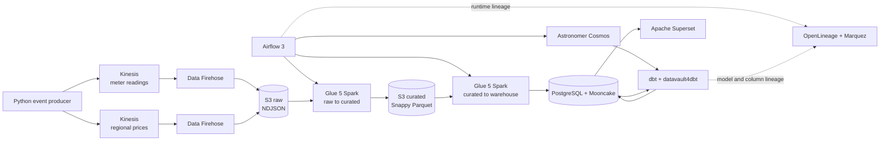

The control plane is kept separate from analytics. Airflow and Superset metadata live
in ordinary PostgreSQL, not in the Mooncake warehouse. LocalStack supplies S3, Kinesis,
Firehose, DynamoDB, IAM, Secrets Manager, STS, and CloudWatch Logs. It does not execute
the ETL jobs: Airflow starts short-lived containers derived from AWS's official
`public.ecr.aws/glue/aws-glue-libs:5` image.

LocalStack's ready hook creates the empty raw and curated buckets idempotently so storage
is available immediately after a volume reset. Terraform remains authoritative for
bucket configuration and owns the streams, Firehose deliveries, IAM, secrets, and the
bookmark table.

### Why Mooncake instead of local Redshift?

Redshift is the obvious AWS warehouse for this architecture, but it is not a useful
local dependency here. LocalStack's more advanced Redshift emulation, including the
Redshift Data API, is tied to paid plan capabilities, and its own documentation describes
API coverage rather than a byte-for-byte Redshift engine. An emulator cannot reproduce
the full behavior, optimizer, workload management, performance, or operational profile
of an actual Redshift cluster. See LocalStack's current [Redshift coverage](https://docs.localstack.cloud/aws/services/redshift/)
and [plan comparison](https://docs.localstack.cloud/aws/licensing/).

Mooncake gives this project something more useful: a real PostgreSQL endpoint for dbt,
Cosmos, Glue JDBC loads, and Superset, backed by a column-oriented Iceberg engine. SQL is
easy to inspect, the whole stack runs locally, and idempotent PostgreSQL loading patterns
can be tested for real. It is not presented as a Redshift substitute. A production AWS
deployment would validate models against Redshift and replace the local Docker operators
with managed Glue and, optionally, MWAA.

The published `mooncakelabs/pg_mooncake` image uses filesystem storage. Curated S3 is
therefore the durable lakehouse boundary in this POC; Mooncake-managed Iceberg files are
local. Sending those files directly to S3 would require a Mooncake/Moonlink build with
S3 storage enabled.

## Data flow

Meter readings and effective-dated electricity prices are independent event streams.
Prices cover all 50 states and the District of Columbia and use the four US Census
regions. dbt aligns a meter with its state and region, then applies the price effective
for the reading hour.

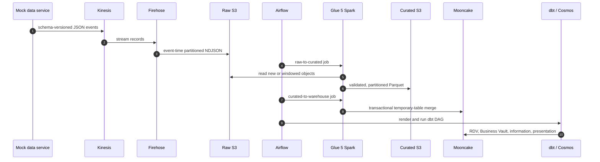

The completed Airflow run makes the same orchestration concrete. The two Glue branches
load meter and pricing data in parallel before Cosmos expands the dbt project into its
model-level dependency graph and finishes with the project tests.

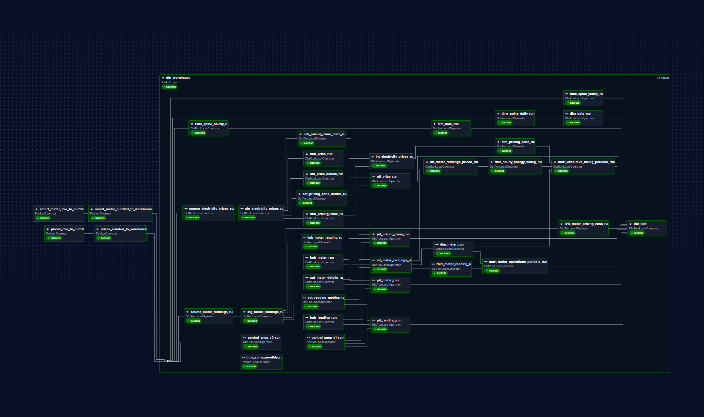

Raw meter data lands at:

```text
s3://local-smart-meter-raw-s3/meter-readings/year=2026/month=08/day=03/hour=14/...
```

Curated meter data lands at:

```text
s3://local-smart-meter-curated-s3/meter_readings/year=2026/month=08/day=03/part-....parquet
```

Firehose failures and Glue quarantine records remain replayable JSON under
`errors/source=.../stage=.../error_type=...`. Bad records never reach the warehouse.

The official local Glue image does not support managed job bookmarks, so incremental
jobs use a DynamoDB ledger of successfully processed S3 objects. The ledger advances
only after the Glue job's outputs succeed. Spark removes duplicate event IDs within each
batch, while PostgreSQL primary keys and `ON CONFLICT` merges make retries idempotent.

Warehouse loading is transactional per Spark partition rather than across the entire
Glue job. If one partition commits and a later partition fails, the source object is not
bookmarked and the next run retries it. Already committed rows are safely ignored or
updated by the warehouse constraints. In managed AWS Glue, the local ledger arguments
can be omitted and the same transformation contexts can use native Glue bookmarks.

## Warehouse model

The warehouse keeps source history in a Raw Data Vault and presents a conventional
galaxy schema to BI consumers. `datavault4dbt` builds the hubs, links, satellites, PIT
tables, and snapshot controls. Ghost records are disabled: every vault key must trace
back to a source row.

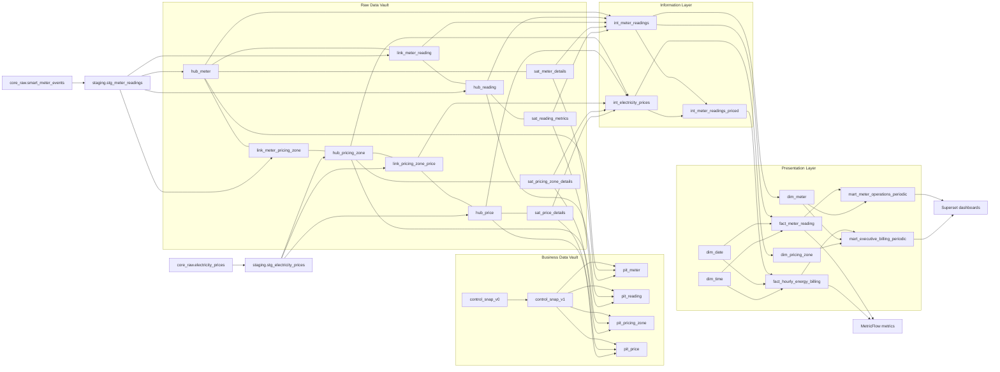

### Raw Data Vault model

The Raw Data Vault model is intentionally split by business key. Meter and reading
identity are independent, as are pricing-zone and price identity. Links record their
relationships, while satellites carry descriptive or changing attributes and preserve
load history.

```mermaid
erDiagram
    HUB_METER ||--o{ SAT_METER_DETAILS : describes
    HUB_METER ||--o{ LINK_METER_READING : participates
    HUB_READING ||--o{ LINK_METER_READING : identifies
    HUB_READING ||--o{ SAT_READING_METRICS : measures

    HUB_METER ||--o{ LINK_METER_PRICING_ZONE : assigned_to
    HUB_PRICING_ZONE ||--o{ LINK_METER_PRICING_ZONE : contains
    HUB_PRICING_ZONE ||--o{ SAT_PRICING_ZONE_DETAILS : describes

    HUB_PRICING_ZONE ||--o{ LINK_PRICING_ZONE_PRICE : priced_by
    HUB_PRICE ||--o{ LINK_PRICING_ZONE_PRICE : applies_to
    HUB_PRICE ||--o{ SAT_PRICE_DETAILS : describes

    HUB_METER {
        string hk_meter_h PK
        string meter_id UK
        timestamp ldts
        string rsrc
    }
    HUB_READING {
        string hk_reading_h PK
        string event_id UK
        timestamp ldts
        string rsrc
    }
    HUB_PRICING_ZONE {
        string hk_pricing_zone_h PK
        string state_code UK
        timestamp ldts
        string rsrc
    }
    HUB_PRICE {
        string hk_price_h PK
        string price_id UK
        timestamp ldts
        string rsrc
    }
    LINK_METER_READING {
        string hk_meter_reading_l PK
        string hk_meter_h FK
        string hk_reading_h FK
        timestamp ldts
        string rsrc
    }
    LINK_METER_PRICING_ZONE {
        string hk_meter_pricing_zone_l PK
        string hk_meter_h FK
        string hk_pricing_zone_h FK
        timestamp ldts
        string rsrc
    }
    LINK_PRICING_ZONE_PRICE {
        string hk_pricing_zone_price_l PK
        string hk_pricing_zone_h FK
        string hk_price_h FK
        timestamp ldts
        string rsrc
    }
    SAT_METER_DETAILS {
        string hk_meter_h FK
        string hd_meter_details_s
        string schema_version
        string us_region
        string state_code
        timestamp ldts
        string rsrc
    }
    SAT_READING_METRICS {
        string hk_reading_h FK
        string hd_reading_metrics_s
        timestamp event_time
        decimal energy_kwh
        decimal voltage_v
        decimal current_a
        decimal power_factor
        timestamp ldts
        string rsrc
    }
    SAT_PRICING_ZONE_DETAILS {
        string hk_pricing_zone_h FK
        string hd_pricing_zone_details_s
        string us_region
        string currency_code
        timestamp ldts
        string rsrc
    }
    SAT_PRICE_DETAILS {
        string hk_price_h FK
        string hd_price_details_s
        string schema_version
        timestamp effective_from
        decimal price_per_kwh
        timestamp ldts
        string rsrc
    }
```

### Business Data Vault model

The Business Data Vault defines stable reporting snapshots and PIT lookup structures.
`control_snap_v0` generates the reporting calendar, while `control_snap_v1` applies the
daily, weekly, monthly, and yearly retention rules. Each PIT table resolves the applicable
satellite version for one business entity and retained snapshot timestamp.

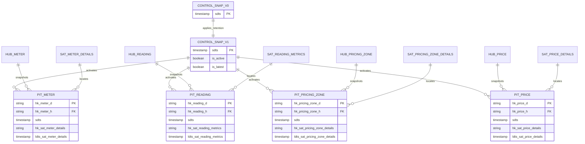

### Information layer model

The Information layer reconstructs current business records from the Vault and makes the
effective-dated pricing relationship explicit. It is still analytics-neutral: billing and
operational facts are shaped later in the Presentation layer.

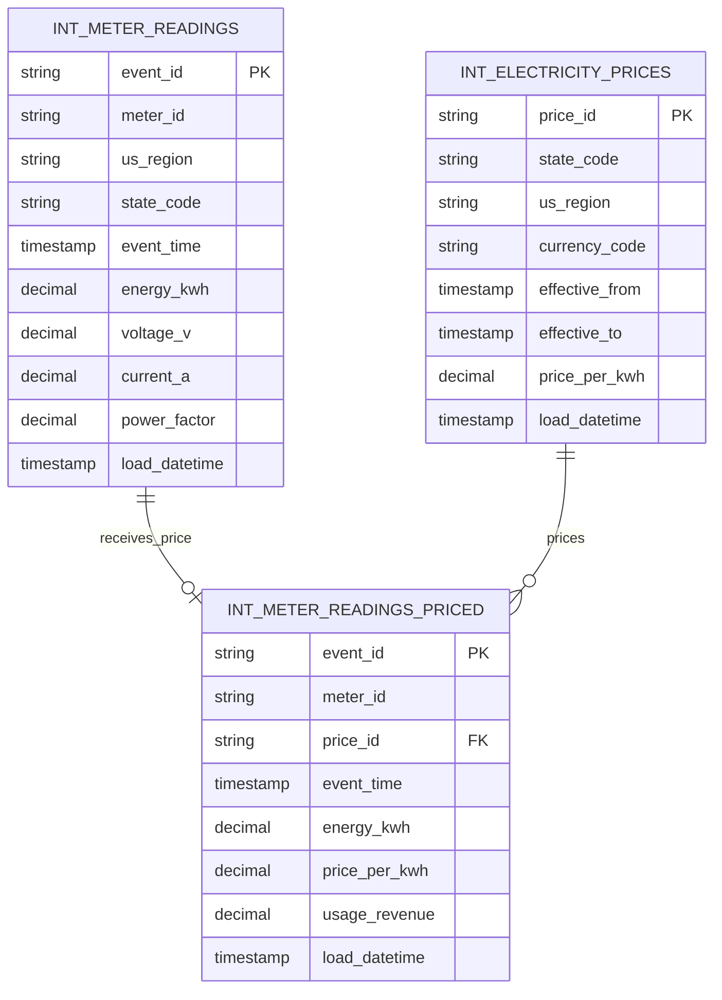

### Presentation galaxy and starflake

The presentation layer is a **galaxy schema** (also called a fact constellation) because
multiple fact tables share the same conformed dimensions. `fact_meter_reading` keeps one
row per meter event for operational and electrical analysis. `fact_hourly_energy_billing`
has a different grain—one row per meter, pricing zone, and hour—and supports finance
measures. Both facts reuse `dim_date`, `dim_time`, `dim_meter`, and
`dim_pricing_zone`. A date, meter, or
region filter therefore means the same thing across operational and billing analysis.

Within that galaxy, each fact exposes a simple **star** access path for BI queries. The
model is starflake-style rather than deeply snowflaked: reusable domains such as pricing
zone, date, and time have their own dimensions, while frequently queried labels
such as state and Census region remain on the meter and pricing-zone dimensions. This
selective normalization avoids repeating domain logic across facts without forcing
Superset through long dimension-to-dimension join chains.

The periodic marts sit above the atomic galaxy. They pre-aggregate the same governed
facts at Year, Month, Week, Day, and Hour grains for dashboard drill paths. They improve
interactive performance but do not redefine measures or create a separate dimensional
model; dbt and MetricFlow remain the source of metric meaning.

The conformed dimensions and fact relationships are:

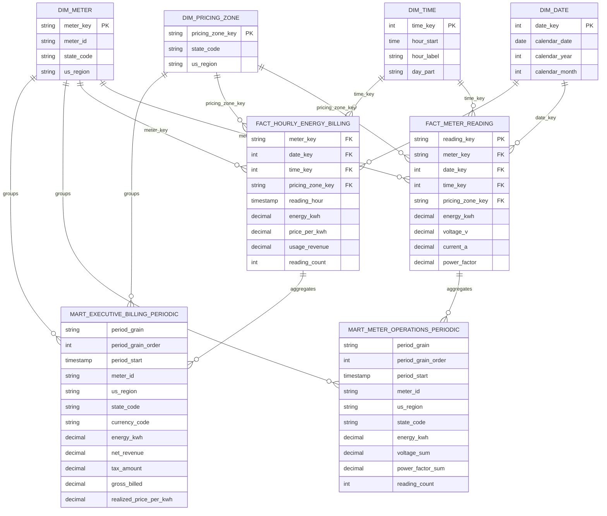

### Presentation modeling: stars, starflake, and galaxy

The presentation layer is a **galaxy schema** (also called a fact constellation): two
related star schemas share the same conformed dimensions.

- The operational star is centered on `fact_meter_reading`, with one row per meter
  event. It joins to meter, date, time, and pricing-zone dimensions.
- The billing star is centered on `fact_hourly_energy_billing`, with one row per meter
  and reading hour. It reuses meter, date, time, and pricing-zone dimensions so an hour,
  meter, state, or Census region has the same meaning in operational and finance work.

That reuse is what turns the two stars into a galaxy rather than two unrelated marts.
It also allows MetricFlow and Superset filters to behave consistently across consumption,
electrical, pricing, and revenue measures.

The wider warehouse can reasonably be described as **starflake-like**: the historized
Data Vault and information models are normalized upstream, while the presentation
dimensions are deliberately flattened for BI. It is not a classic snowflake schema at
the presentation boundary—state and Census-region attributes stay on the meter and
pricing-zone dimensions instead of forcing dashboard queries through additional
geography tables. This keeps Superset SQL simple while dbt retains the normalized,
auditable history behind it.

The periodic operations and billing marts sit above the atomic facts. They pre-aggregate
the same measures at Year, Month, Week, Day, and Hour grains for dashboard drill paths;
they do not introduce a competing dimensional model or redefine the metrics.

The layers are:

1. **Raw S3** — immutable Firehose JSON and replayable error records.
2. **Curated S3** — validated Snappy Parquet partitioned by event date.
3. **`core_raw`** — source-aligned, idempotently loaded warehouse tables.
4. **`staging`** — typed views plus Data Vault hash keys and hashdiffs.
5. **`rdv`** — insert-only hubs, links, and historized satellites.
6. **`business_vault`** — retained snapshot controls and PIT tables for
   closed-period/as-of reporting.
7. **`information`** — current-state readings, effective-dated prices, and their billing
   join. Business Vault PIT tables remain available for closed-period/as-of reporting.
8. **`presentation`** — conformed dimensions, atomic facts, and periodic marts.
9. **MetricFlow** — governed entities, measures, metrics, and saved KPI queries.

Snapshot retention is logarithmic: daily periods for 30 days, weekly for six months,
monthly for three years, and yearly indefinitely. The governed dbt time spines feed both
MetricFlow and the conformed date/time dimensions. Periodic marts expose chronological
year, month, week, day, and hour drill paths without sending every atomic point to
Superset by default.

## Superset dashboards

Superset is a consumer of the presentation layer, not a place where business rules are
hidden. Billing calculations, time grains, and conformed dimensions are built and tested
in dbt before Superset reads them. The dashboards are provisioned from code, including
their datasets, charts, layout, native filters, and default drill level.

### Smart Meter Operations

Open: <http://localhost:6002/superset/dashboard/smart-meter-operations/>

This is the fleet-level operational view. It answers how much energy is being consumed,
how many readings and meters are reporting, which meters are the largest consumers, and
whether voltage and power factor remain healthy alongside the consumption trend.

The dashboard opens at the yearly rollup rather than requesting every hourly point.
Operators can move through Year, Month, Week, Day, and Hour in chronological order and
apply a shared time-range filter. Those drill levels come from
`presentation.mart_meter_operations_periodic`.

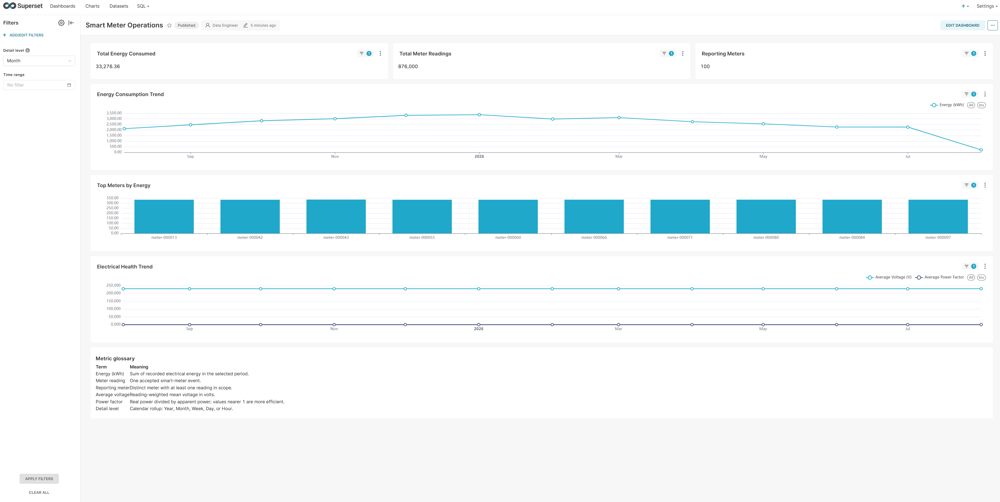

### Smart Meter Data Quality

Open: <http://localhost:6002/superset/dashboard/smart-meter-data-quality/>

This view is for data and platform operations. It focuses on voltage behavior,
power-factor behavior, and electrical health over time. It uses the same governed
operations mart and drill controls, which keeps investigations aligned with the
operational dashboard instead of creating a second definition of the data.

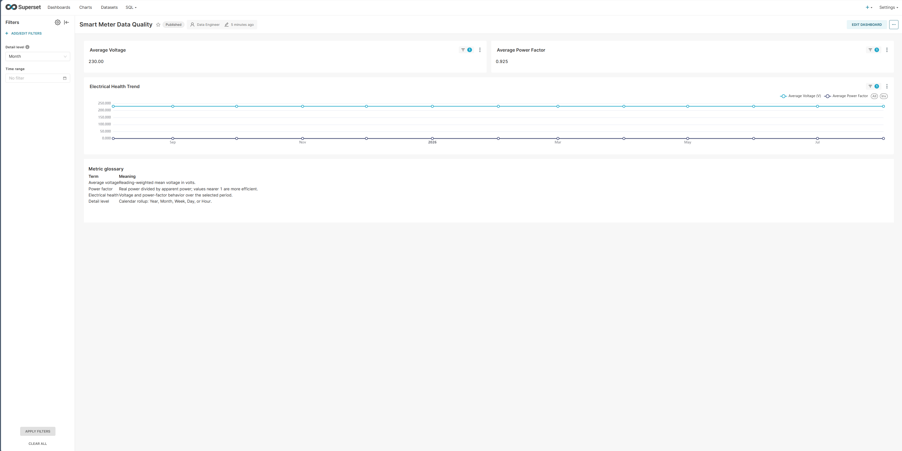

### Executive Billing & Revenue

Open: <http://localhost:6002/superset/dashboard/executive-billing-revenue/>

This is the finance view built from `presentation.mart_executive_billing_periodic`. Its
headline measures are billed energy, net revenue, gross billed amount, active billed
meters, and realized price per kWh. Region and state breakdowns explain where revenue is
coming from, while the billing trend shows how consumption and effective-dated regional
prices combine over time.

The same Year-to-Hour drill path is available, but the default is deliberately coarse so
an executive view does not issue an all-history hourly query on first load. Metric logic
stays in dbt and MetricFlow; Superset is responsible for filtering and visualization.

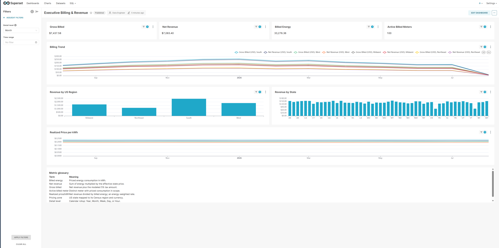

## Running it

You need Docker Compose v2, `make`, and a LocalStack auth token.

```bash
make init
# Set LOCALSTACK_AUTH_TOKEN in .env
make up
```

`make up` initializes and applies the LocalStack Terraform before starting the platform.

`make up` starts the platform but not the event producer. Start live meter and price
events explicitly:

```bash
make events
```

The local UIs are:

| Service | URL | Login |
| --- | --- | --- |
| Airflow | <http://localhost:6001> | `admin` / `admin` |
| Superset | <http://localhost:6002> | `admin` / `admin` |
| Marquez | <http://localhost:6004> | none |

Mooncake and LocalStack are not exposed to the host. Containers reach them at
`mooncake:5432` and `localstack:4566`.

Airflow exposes dbt Docs under **Browse → dbt Docs**. Marquez shows runtime lineage from
Airflow/Cosmos plus the lake, relation, and column lineage published by the
`smart_meter_lineage_catalog` DAG.

## Backfills and reprocessing

Historical generation writes deterministic daily NDJSON directly to raw S3. It bypasses
Kinesis and Firehose on purpose; streaming a year of seed data through a local broker is
slow and does not prove anything useful.

```bash
DAYS=365 make backfill
```

Run `make up` first so LocalStack and its Terraform-managed resources exist. The backfill
command only generates data; it does not provision infrastructure. The generated range
is aligned to complete UTC days and the command rebuilds the producer image before it
runs.

Then trigger one windowed warehouse run:

```bash
MODE=backfill \
START=2025-08-04T00:00:00Z \
END=2026-08-04T00:00:00Z \
GRAIN=day \
make pipeline
```

The window is half-open: start is included and end is excluded. Bounds must be UTC
midnight because curated files are partitioned by day. `GRAIN=day` is the safe default;
`GRAIN=week` uses Monday-to-Monday UTC batches, while `GRAIN=month` further reduces
scheduling overhead with larger batches. Glue reads only the S3
partition roots intersecting the window and uses dynamic partition overwrite, so a
backfill cannot erase curated partitions outside its range.

In the Airflow UI, choose **Trigger → Single Run** and supply the same values:

```json
{
  "processing_mode": "backfill",
  "backfill_start": "2025-08-04T00:00:00Z",
  "backfill_end": "2026-08-04T00:00:00Z",
  "backfill_grain": "day"
}
```

Do not use Airflow's scheduled-run backfill screen for this DAG. Its normal schedule is
every 15 minutes, while the Glue jobs operate on an explicit S3 window. Recreating a year
of 15-minute logical runs would only queue thousands of duplicate replays.

## Useful commands

```bash
make test       # Python and Glue library tests
make lint       # Ruff
make dbt        # dbt build
make metrics    # parse and list MetricFlow metrics
make logs       # follow Compose logs
make down       # stop containers
make reset      # stop containers and remove persistent volumes
```

AWS resource names follow `{env}_{name}_{resource_shortcode}`, such as
`local_smart_meter_events_kds`. S3 bucket names use hyphens because bucket DNS names do
not allow underscores.

## Repository map

| Path | Purpose |
| --- | --- |
| `services/mock-data-service` | Extensible meter and price event producer plus raw backfill CLI |
| `infra/terraform` | LocalStack-compatible AWS infrastructure and modules |
| `jobs/glue` | Glue 5 Spark entry points and the domain-neutral `glue_lib` |
| `platform/airflow` | Airflow/Cosmos image, warehouse DAG, and lineage catalog DAG |
| `platform/dbt` | Staging, Data Vault, information, presentation, and semantic models |
| `platform/mooncake` | Warehouse initialization |
| `platform/superset` | Superset image and dashboard bootstrap |

## What I would add next

- Iceberg compaction, snapshot expiration, and orphan-file cleanup.
- Integration tests covering Kinesis through Firehose into S3.
- Throughput, iterator-age, delivery-failure, freshness, and bad-record-rate monitoring.
- A documented scale and cost model for shards, Firehose buffers, S3 file sizing,
  partition pruning, and warehouse scans.

## Glossary

### Dashboard measures and filters

| Term | Meaning in this project |
| --- | --- |
| **Energy (kWh)** | Electrical energy recorded by meter readings. Dashboard totals sum `energy_kwh` over the selected scope. |
| **Meter reading** | One validated smart-meter event identified by `event_id`. |
| **Reporting meter** | A distinct meter with at least one accepted reading in the selected scope. |
| **Voltage (V)** | Electrical potential measured in volts. Dashboard averages are weighted by reading count. |
| **Current (A)** | Electrical current measured in amperes. |
| **Power factor** | Real power divided by apparent power. Values nearer 1 indicate more efficient power use. |
| **Billed energy** | Consumption that successfully matched an effective electricity price, measured in kWh. |
| **Price per kWh** | Effective-dated electricity rate for a state and its US Census region. |
| **Net revenue** | Sum of `energy_kwh × price_per_kwh` before the modeled tax amount. |
| **Tax amount** | A 5% illustrative tax calculated by the billing mart; it is POC logic, not a jurisdictional tax engine. |
| **Gross billed** | Net revenue plus the modeled tax amount. |
| **Realized price per kWh** | Net revenue divided by billed energy. This is an energy-weighted rate, not an average of row-level prices. |
| **Active billed meter** | A distinct meter with priced consumption in the selected scope. |
| **Pricing zone** | A US state used as the rate-matching key, with Census region and currency attributes. |
| **Detail level** | Dashboard aggregation grain in chronological order: Year, Month, Week, Day, or Hour. |
| **Time range** | Inclusive dashboard filter applied to the selected periodic mart rows. |

### Data platform and warehouse terms

| Term | Meaning in this project |
| --- | --- |
| **Raw zone** | Immutable NDJSON delivered to S3 before business validation or type normalization. |
| **Curated zone** | Validated Snappy Parquet partitioned by event year, month, and day. |
| **Bookmark** | A checkpoint identifying source data already processed. Local Glue jobs store object-level checkpoints in DynamoDB. |
| **Idempotent** | Safe to retry without producing a second logical warehouse record or erasing unrelated partitions. |
| **RDV** | Raw Data Vault: insert-only hubs, links, and satellites retaining source-aligned history. |
| **Hub** | Stable business identity such as meter, reading, pricing zone, or price. |
| **Link** | Relationship between hub identities, such as a meter producing a reading. |
| **Satellite** | Descriptive or changing attributes historized against a hub or link hash key. |
| **Hash key** | Deterministic key generated from a business key or relationship; names begin with `hk_`. |
| **Hashdiff** | Hash of a satellite payload used to detect a changed descriptive state; names begin with `hd_`. |
| **Business Data Vault** | Derived Vault structures used here for snapshot controls, retention rules, and PIT tables. |
| **PIT table** | Point-in-time helper resolving which satellite record was valid for a retained reporting snapshot. |
| **Information layer** | Consumer-friendly current readings, effective prices, and their priced-reading join. |
| **Conformed dimension** | A dimension whose key and meaning are shared by multiple facts, such as meter, date, time, or pricing zone. |
| **Star schema** | One fact table surrounded by flattened dimensions optimized for analysis. |
| **Galaxy schema** | Multiple fact tables sharing conformed dimensions; also called a fact constellation. |
| **Starflake** | This project's combination of normalized Vault history upstream and flattened star-schema dimensions at the BI boundary. |
| **MetricFlow** | dbt's governed semantic and metric evaluation layer. |
| **Lineage** | Recorded relationships showing how source objects, jobs, tables, models, and columns produce downstream data. |

## Technology references

### AWS data platform

- [Amazon S3](https://docs.aws.amazon.com/s3/) provides the object storage behind the
  raw and curated lake zones.
- [Kinesis Data Streams](https://docs.aws.amazon.com/streams/latest/dev/introduction.html)
  accepts the live meter and electricity-price event streams.
- [Amazon Data Firehose](https://docs.aws.amazon.com/firehose/latest/dev/what-is-this-service.html)
  buffers Kinesis records and delivers them into the partitioned raw S3 zone.
- [AWS Glue 5.0](https://docs.aws.amazon.com/glue/latest/dg/release-notes.html) supplies
  the managed Spark runtime used by the validation, curation, and warehouse-load jobs.
- [DynamoDB](https://docs.aws.amazon.com/amazondynamodb/latest/developerguide/Introduction.html)
  stores the object-processing ledger used in place of managed Glue bookmarks locally.

### Local infrastructure

- [Docker Compose](https://docs.docker.com/compose/) runs the complete development
  platform and gives its services a shared internal network.
- [LocalStack](https://docs.localstack.cloud/) emulates the AWS APIs needed by the POC,
  including S3, Kinesis, Firehose, DynamoDB, Secrets Manager, and IAM.
- [Terraform](https://developer.hashicorp.com/terraform/docs) defines and provisions
  the AWS-shaped infrastructure consistently instead of relying on manual setup.

### Processing and orchestration

- [Python](https://docs.python.org/3/) is used for the mock producers, Glue entry points,
  Airflow DAGs, shared libraries, tests, and platform bootstrap code.
- [Apache Spark](https://spark.apache.org/docs/latest/) performs distributed parsing,
  validation, deduplication, partitioning, and Parquet processing inside Glue.
- [Apache Airflow](https://airflow.apache.org/docs/) schedules and monitors the complete
  raw-to-curated, warehouse, dbt, and lineage workflow.
- [Astronomer Cosmos](https://astronomer.github.io/astronomer-cosmos/) renders the dbt
  project as native Airflow task groups while preserving model-level dependencies.

### Warehouse and modeling

- [PostgreSQL](https://www.postgresql.org/docs/) provides the SQL engine and ecosystem
  used by the analytical warehouse.
- [pg_mooncake](https://pgmooncake.com/docs/installation) adds columnar analytics and
  lake-oriented capabilities to PostgreSQL, making it a practical local Redshift stand-in.
- [Apache Iceberg](https://iceberg.apache.org/docs/latest/) is the open table format used
  to give lake data schema evolution, snapshots, and transactional table metadata.
- [dbt](https://docs.getdbt.com/) builds, tests, documents, and orders warehouse
  transformations from staging through the presentation layer.
- [datavault4dbt](https://www.datavault4dbt.com/documentation/) supplies the macros used
  to build the Raw Data Vault, snapshot controls, and point-in-time structures.
- [dbt-utils](https://hub.getdbt.com/dbt-labs/dbt_utils/latest/) provides reusable dbt
  macros that keep common SQL and tests out of individual models.
- [MetricFlow](https://docs.getdbt.com/docs/build/about-metricflow) defines governed
  dimensions and metrics above the presentation facts for consistent KPI calculation.

### BI and lineage

- [Apache Superset](https://superset.apache.org/docs/intro) serves the operational,
  electrical-health, and executive billing dashboards.
- [OpenLineage](https://openlineage.io/docs/) is the event standard used to describe job,
  dataset, and column-level lineage across Airflow, Glue, and dbt.
- [Marquez](https://marquezproject.ai/docs/) receives OpenLineage events and provides the
  searchable lineage UI exposed by the local platform.

### Diagrams

- [Mermaid](https://mermaid.js.org/intro/) keeps architecture and warehouse diagrams as
  version-controlled text alongside the code they describe.
- [Mermaid Chart](https://www.mermaidchart.com/) provides a richer editor and renderer
  for working with the Mermaid models in this README.
